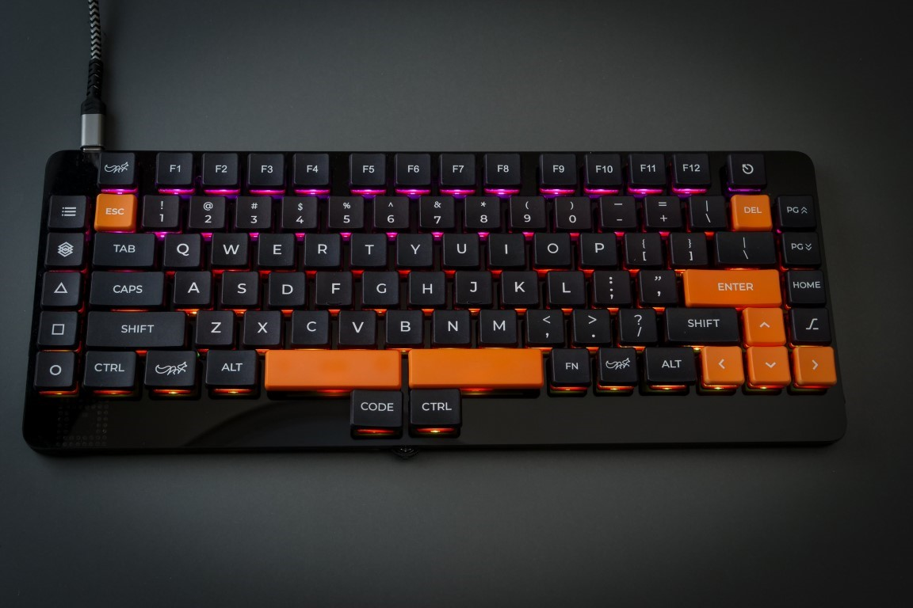

# ALIEN-88 -  Self-made Mechanical Keyboard 
   

## Documents

 - [About ALIEN88](https://coal.hatenablog.com/entry/2023/04/22/190904) (In Japanse article)
 - [ALIEN88  Installation Guide](doc/installation_guide.md)
 - [User's Guide](doc/users_guide.md)

## Firmwware
 - [QMK Firmware](https://github.com/hanachi-ap/kbd_firmware/tree/main/qmk_firmware/keyboards/hanachi_ap/) (for qmk_firmware_0.18.17)
 - PRK Firmware (not yet)

## Resources
  - Please hold on for a moment regarding this information.
