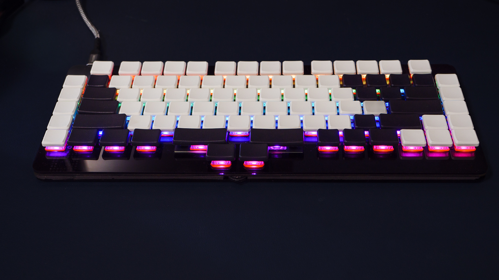

# ALIEN-88  TKL Mech Keyboard for gaming

  

## Specs
- TKL Mechanical Keyboard
- N-key roll over and anti-ghost
- Hot-swappable Choc low-profile key switches
- Utility keys added to right and left
- Extensive thumb keys arrangement
- Programmable wheel knob
- All keys can be redefined
- User-defined keymap of up to 10 layers
- USB wired connection
- Full-color LED lights
- Dimentions:  332mm x 133mm x 8.6mm (Excluding caps and switches)

## Project

 - [Dcuments](doc/index.md)
 - [Firmware](firmware/)
 - [json file for VIA/REMAP](firmware/via/alien88_via.json)
 - [Acrylic plate data (ai.zip)](lib/alia88_acrylic_Laser_450x300.zip)

 