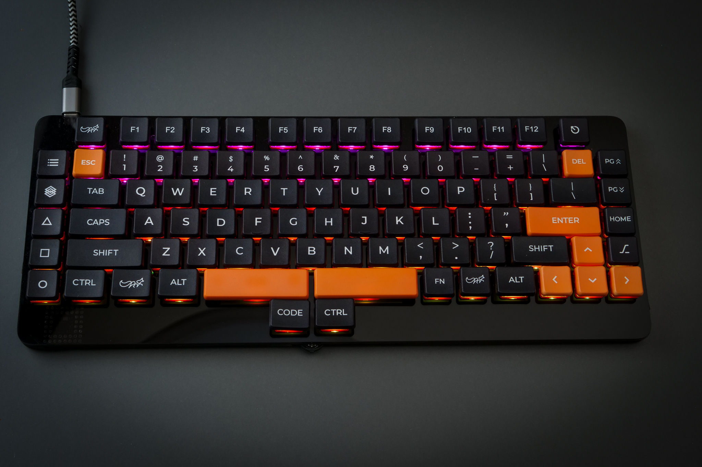

# ALIEN-88  TKL Mech Keyboard for gaming

 
Introducing the ALIEN 88 keyboard, designed for gamers. This homebrewed keyboard project will revolutionize the gaming experience with its sleek and futuristic design, as well as its innovative features. The ALIEN 88 will be the ultimate tool for taking your gaming skills to the next level. The development project is currently in the closed beta phase, so stay tuned for more updates. The ALIEN 88 keyboard will transform your gaming experience and become the ultimate weapon for enhancing your gaming skills.

  

## Specs

- Stylish and sophisticated TKL Mechanical Keyboard designed for gamers
- Slim and compact design perfect for any gaming setup
- N-key rollover and anti-ghosting technology for accurate keystroke registration
- Hot-swappable low-profile key switches for easy customization
- Utility keys on both sides of the device for quick access to shortcuts and macros
- Colorful LED lighting for a unique touch
- Improved thumb key layout for a comfortable typing experience
- Programmable wheel knob for easy volume adjustment and other customizable operations
- All keys are fully reassignable
- Customizable keymap supports up to 10 layers for maximum efficiency during gameplay
- Stable and fast USB wired interface for reliable connectivity
- Dimentions:  332mm x 133mm x 8.6mm (Excluding caps and switches)

We're excited to announce the upcoming release of the ALIEN 88, a game-changing keyboard designed for serious gamers. With its cutting-edge features and sleek design, this homebrewed keyboard project is poised to take the gaming world by storm. While we can't yet provide a release date, we invite you to stay tuned for updates and give us your feedback. We're eager to hear from passionate gamers like you as we prepare to unleash the ALIEN 88 upon the world. Get ready to experience gaming like never before!

 

## Project

 - [Dcuments](doc/index.md)
 - [Firmware](firmware/)
 - [json file for VIA/REMAP](firmware/via/alien88_via.json)
 - [Acrylic plate data (ai.zip)](lib/alia88_acrylic_Laser_450x300.zip)

 