# ALIEN-88  TKL Mech Keyboard for gaming

## Specs

- ゲーマー向けにデザインされたスタイリッシュで洗練されたテンキーレス(TKL)メカニカルキーボード
- どんなゲーミングセットアップにも最適なスリムでコンパクトなデザイン
- Nキーロールオーバーとアンチゴーストテクノロジーにより、正確なキーストローク登録を実現。
- ホットスワップ可能なロープロファイル・キースイッチにより、カスタマイズが容易。
- ショートカットやマクロに素早くアクセスできるユーティリティキーを本体両面に搭載
- 全キーLED照明で個性的な演出
- 親指キーのレイアウトを改善し、快適なタイピングを実現
- 音量調整などのカスタマイズが簡単にできるプログラマブルホイールノブ
- すべてのキーは完全に再割り当て可能です。
- カスタマイズ可能なキーマップは最大10レイヤーに対応し、ゲームプレイ中の効率を最大限に高めます。
- 安定した高速USB有線インターフェースで、信頼性の高い接続を実現。
  
- キーピッチ: 横方向 19mm、縦方向 17mm
- 外形寸法:  332mm×133mm×8.6mm（キャップ、スイッチ含まず。）

## MCU
- プロセッサー: PR2040 
- ファームウェア:   
    - QMK Firmware (VIA/Remap ready)
    - PRK firmware

# 試作機おすそ分け版

## 同梱品
1. ALIEN-88 キーボード組み立てセット
   - メインインボード(PCB) 1枚
   - アクリルトッププレート 1枚
   - アクリルボトムプレート 1枚
   - スタビライザ用スペーサ 2種 x 4枚
   - ホイールノブ 1個
   - スペーサー 3.5mm 5個
   - ネジ M2 3mmネジ 10個
   - ゴム足 6個
   - スタビライザアタッチメント(2U→3U) 4個

2. ALIEN-88 テンキーパッド 組み立てセット
   - メインボード(PCB) 1枚
   - アクリルトッププレート 1枚
   - アクリルボトムプレート 1枚
   - スタビライザ用スペーサ 2種 x 4枚
   - スペーサー 3.5mm 5個
   - ネジ M2 3mmネジ 10個
   - ゴム足 6個

## 他に必要なパーツ
1. ALIEN-88 キーボード
- Pimoroni PGA2040 1個
  
  https://akizukidenshi.com/catalog/g/gM-16762/

- ピンヘッダ 12ピン 4個

  ProMicroについてきて余ってるもの

- 表面実装用タクトスイッチ　ＴＨＡＦ０１ーＮＣーＲ 1個
  
  https://akizukidenshi.com/catalog/g/gP-14887/

  本来は頒布キットに含めるべきものですが手元の在庫を切らして次の仕入れの予定が無いため各個に手配下さい。PGA2040と合わせて秋月電子通商さんなどから購入すると便利です。

- スイッチソケット(Choc) 91個
- スイッチ(Choc v1) 91個
- Choc用スタビライザ 2U 4個
- LED (SK6812MINI-E) 91個
- USBケーブル (USB A to USB Cのもの)
- Chock V1用 キーキャップ (ANSI US配列に適合の各種)

  ChocFox Legendsキーキャップセットを推奨します。
  https://talpkeyboard.net/items/63c7d570c9883d1ecd88dd32
  
  ChocFox Legends Choc用 キーキャップセットの ALPHA KIT と EXTRA KIT の組み合わせががちょうど適合します。
  分割スペースバーに3Uサイズコンベックスキーキャップを使うときは、頒布キットに同梱のスタビライザアタッチメントを使用して下さい。
  
ダイオードはPCBに取り付け済みです

2. ALIEN-88 テンキーパッド
- スイッチソケット(Choc) 23個
- スイッチ(Choc v1) 23個
- LED (SK6812MINI-E) 23個
- USBケーブル (USB A to USB Cのもの)

テンキーパッドの方はソケットとLED以外のパーツはPCBに取り付け済みです。

## 試作版での既知の不具合
  - USB C to USB C のケーブルは利用できません。

    USB A to UCB Cであれば問題ありません。
    基板のUSB周りの設計のミスです。今後修正予定です

  - プレート取付穴の不一致

    ボトムプレート、PCB、トッププレートを重ねたとき、中央下段位置のネジ穴の位置が
    揃いません。この部分1箇所については構造上大きな影響はないためネジ止めせずに利用して下さい。

  ## つくりかた (ALIEN-88 キーボード本体)
  1. PGA2040をメインボードに取り付ける
  2. タクトスイッチをメインボードに取り付ける
  3. ファームウェアを書き込む
  4. ホイールノブをメインボードに取り付ける
  5. LEDをメインボードに取り付ける
  6. スイッチソケットをメインボードに取り付ける
  7. スタビライザを組み立てる
  8. 全体を組み立てる

### 1. PGA2040をメインボードに取り付ける
最大の山場です。一度間違ったはんだ付けをするとリカバリは非常に難しくなってしまいます。取り付けの歳の表裏、向きに十分注意してください。

メインボードの表側はアクリル製のトッププレートを装着することを想定して
半田の出っ張りがない平らな状況にするのがポイントとなります。そのため正しいはんだ付けの
セオリーから外れたトリッキーなことをします。

1. 12連ピンヘッダを8連 + 4連に切り離す
  
     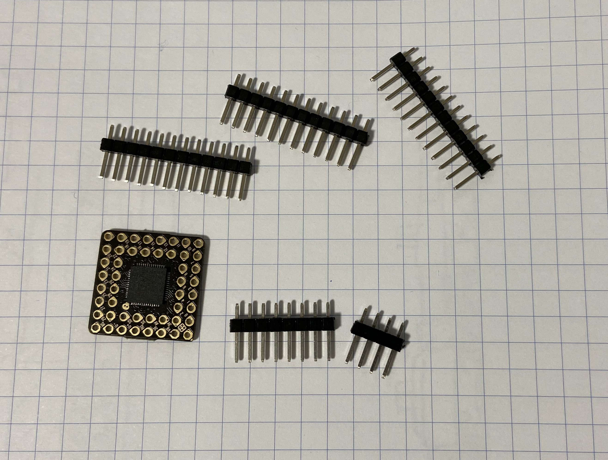

2. ピンの出っ張りを 2.0～2.5mmの長さになるよう細かく調整する

     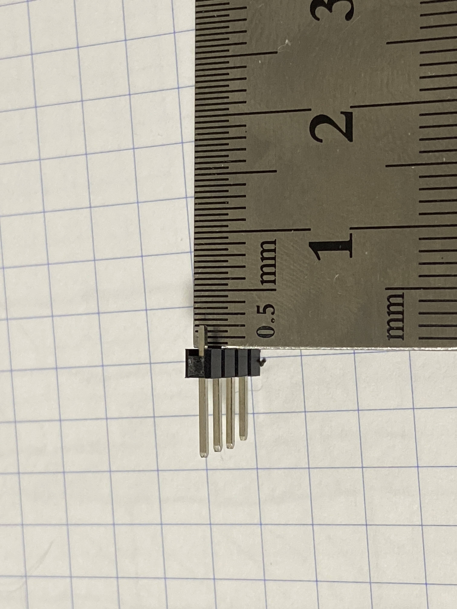

3. メインボードの裏側にPGA2040を配置しテープで仮止めする
    - PGA2040はメインボードの裏側に取り付けます。
    - PGA2040のマークとメインボードのマークが合うように配置します。
    - 次の工程に進む前にオモテウラ、向きを十分に確かめてください。

     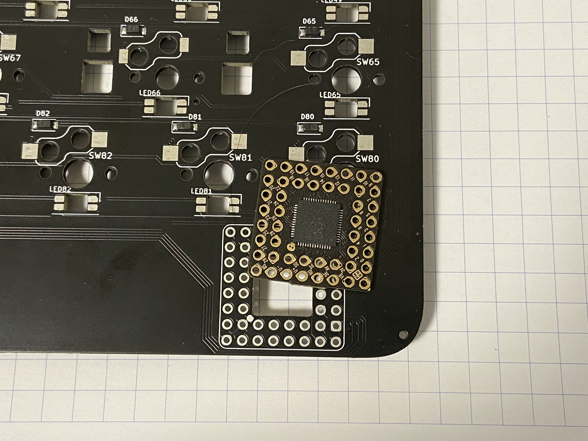

4. メインボードの裏側からピンヘッダを刺し、テープで仮止めする

     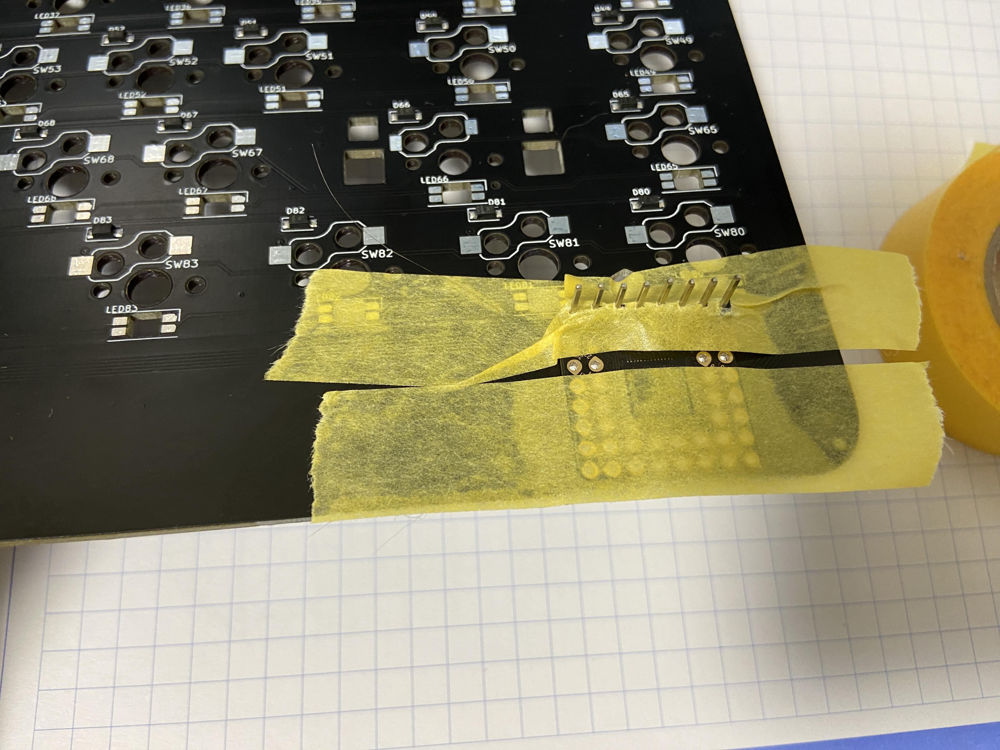

  -   メインボードの表側にピンヘッダが飛び出していないこと、極端に短くないことを確認

      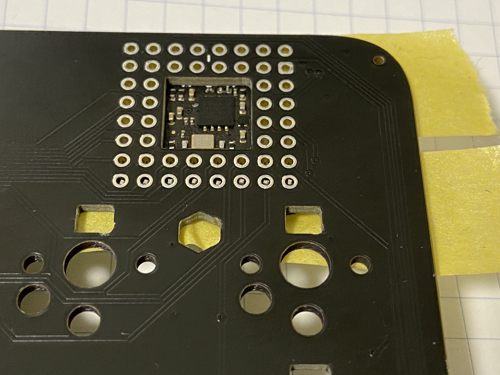

5. メインボードの表側からはんだ付けする。

    - 十分にハンダを入れるとともに山にならないように留意
    - 仕上がりは出っ張りがないツライチになるのが理想

      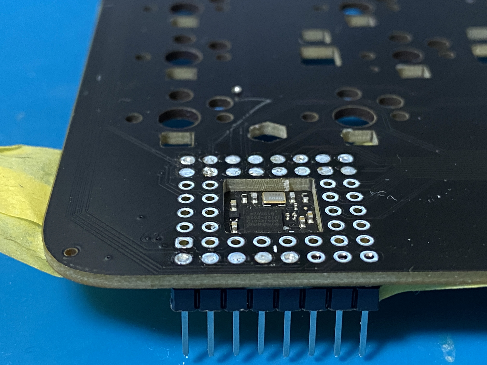

6. メインボードの裏側のピンヘッダの連結部を外し、ニッパーで足を切りそろえる

      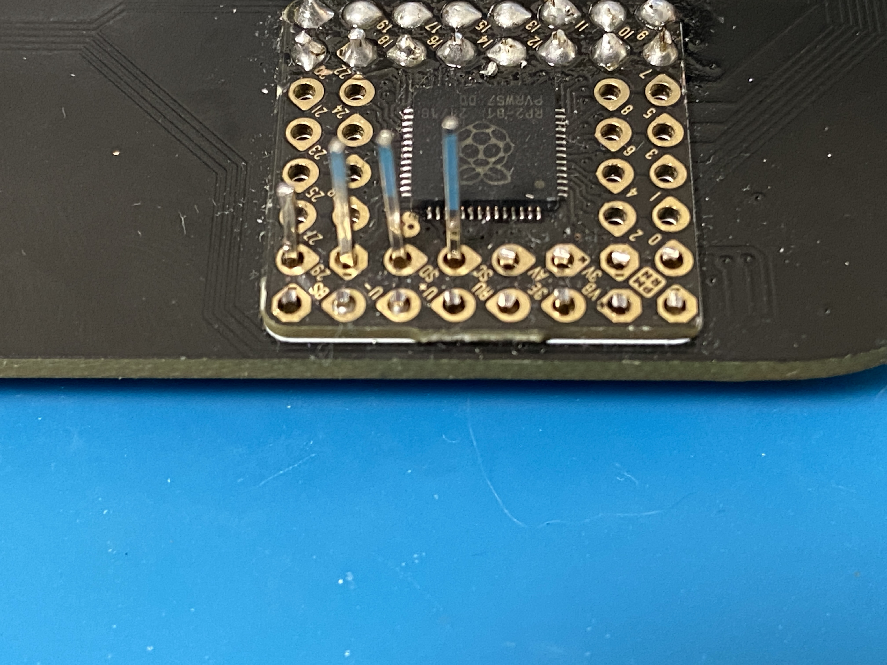
  

7. メインボードの裏側からはんだ付けする。 
    - ここは通常のはんだ付けでOk

8. 4～7の手順を繰り返し、PGA2040のすべてのスルーホールをはんだ付けする

9. ハンダ忘れ、ブリッジなどの不良箇所がないかを自己レビューする

    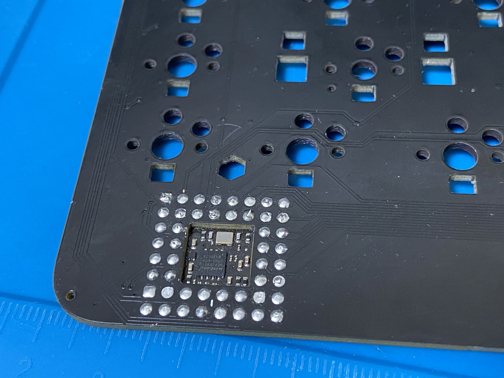

### 2. タクトスイッチをメインボードに取り付ける

1. メインボード裏面のBOOTSELと印字された所にタクトスイッチ配置し、4箇所のパッドをはんだ付けします
   - 小さいサイズなのでブリッジに注意してください
   - 繊細なスイッチなので ハンダづけの際にハンダを盛りすぎるとスイッチ内部に流れ込み
     スイッチが押せなくなってしまうということもありました。注意して作業してください。

    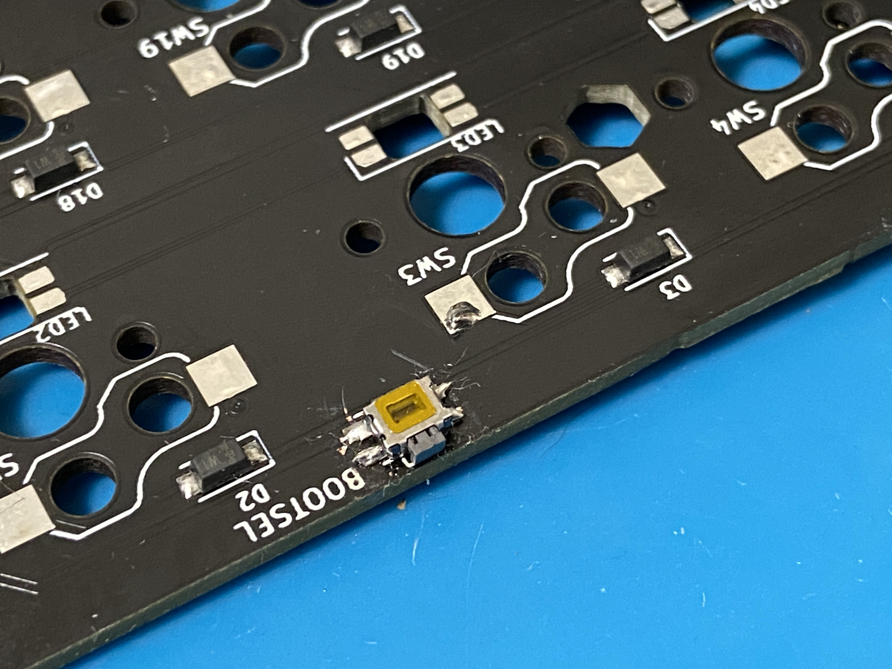
  
### 3. ファームウェアを書き込む
1. PCと接続するまえに改めてハンダ箇所のレビューをする
2. BOOTSELスイッチを押しながらPCとキーボードをUSBケーブルで接続する
3. うまく認識された場合 リムーバブルドライブがマウントされます。該当するドライブをエクスプローラーで開く
   - 認識されない場合一度USBケーブルを外し、改めて注意深くこれまでの作業をレビューする
4. ファームウェアファイル ***.uf2 を、キーボードのドライブフォルダにコピーする
   - コピーが終わり新しいファームウェアが反映されると ドライブは一度アンマウントされます
 
- 作業中は PRKよりQMKのほうが何かと便利なのでおすすめです。
- この段階からキーボードとして認識されるようになります。PCからキーボードとして認識されていることを確認してください

- QMK Firmwareの場合はREMAPでLEDを設定する事ができます。次工程のLED取り付けの前にRGB Testモードにしておく便利です

#### 4. ホイールノブをメインボードに取り付ける
1. メインボードの裏側から、ホイールノブを部品の突起と基板の穴を合わせて配置
2. 6箇所のパッドと左右のパッドをはんだ付けする

    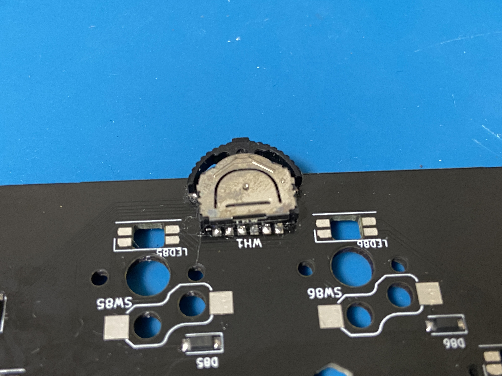

### 5. LEDをメインボードに取り付ける
  - 91個取り付ける。
  - LEDの順序はシルクに書かれた通り。なお LED-1とLED-16は欠番です。

### 6. スイッチソケットをメインボードに取り付ける
  - 91個取り付ける。なお SW-1とSW-16は欠番です。

### 7. スタビライザを組み立てる
  - スタビライザのソケットとステムとバーを組み立てる
  - スタビスペーサAをスタビライザの上からパチンと嵌める
  - スイッチを嵌めるときは、スタビスペーサB スタビスペーサA スイッチの順に重ねて使います
  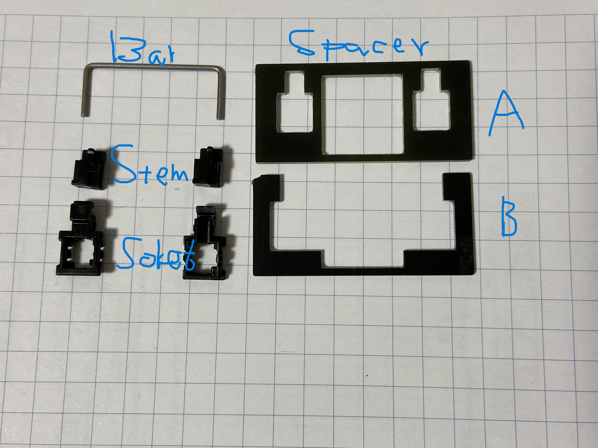
  
  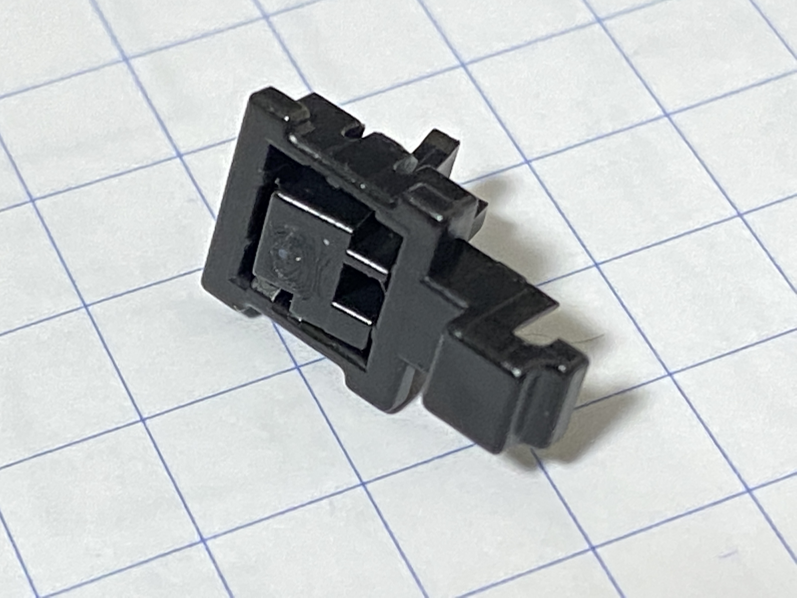
  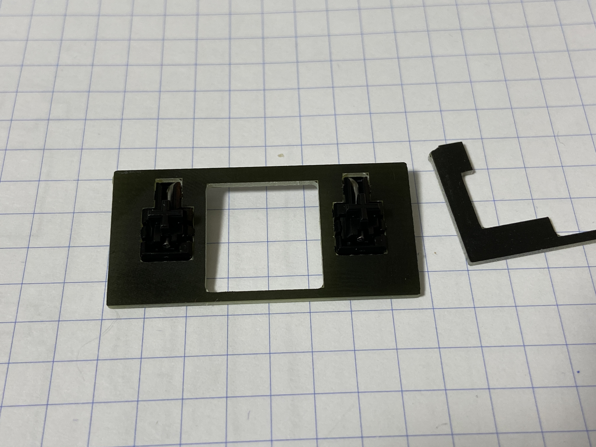
  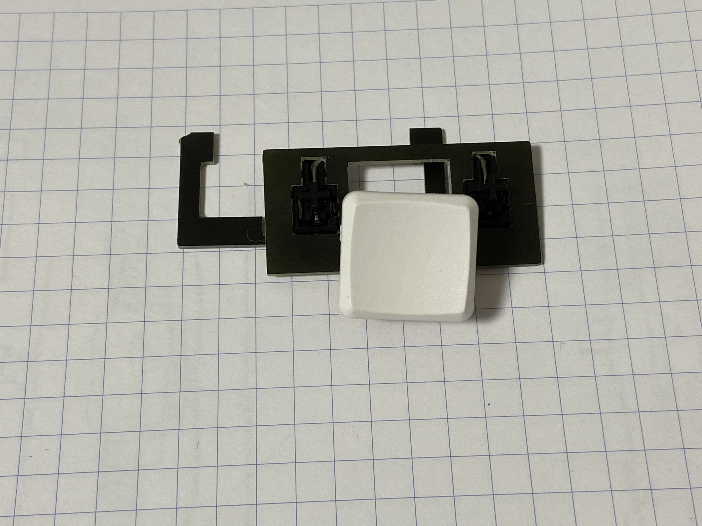

### 8. 本体を組み立てる
  - ボトムプレート、スペーサー、メインボード (トッププレート)をねじで組み上げます

## 作り方  (ALIEN-88 テンキーパッド)

テンキーパッドは主要なパーツはすべて事前に取り付けされています。
ユーザは、スイッチソケット及びLEDをはんだ付けして下さい。

組み立ては ボトムプレート、PCB、トッププレートの順に重ね、スペーサとネジで
固定します。

# つかいかた

BOOTSELボタンを押しながらUSBをPCへ接続するとストレージデバイスがマウントされます。新しいファームウェアをエクスプローラーからコピーすると書き込みが完了します

キーマップの変更はReMAPもしくはVIAが便利です。開発版の段階では公式に登録されていないので、jsonファイルを読み込ませてください。

### ALIEN-88 キーボード  
- QMK Firmware [ergotonic_alien88_via.uf2](../firmware/qmk/ergotonic_alien88_via.uf2)
- PRK Firmware [keymap.rb](../firmware/prk/keymap.rb)
- VIA definition [alien88_via.json](../firmware/via/alien88_via.json)

  デフォルトキーマップでは、一番右上のキーを押しながら一番左下のキーを押すとBOOTSELモードに移行するようになっています。

### ALIEN-88 テンキーパッド

- QMK Firmware [ergotonic_alien88_numpad_via.uf2](../alien88_numpad/firmware/qmk/ergotonic_alien88_numpad_via.uf2)
      
  出荷時に書き込み済みです

- PRK Firmware [keymap.rb](../alien88_numpad/firmware/prk/keymap.rb)
- VIA definition [alien88_numpad_via.json](../alien88_numpad/firmware/via/alien88_numpad_via.json)

