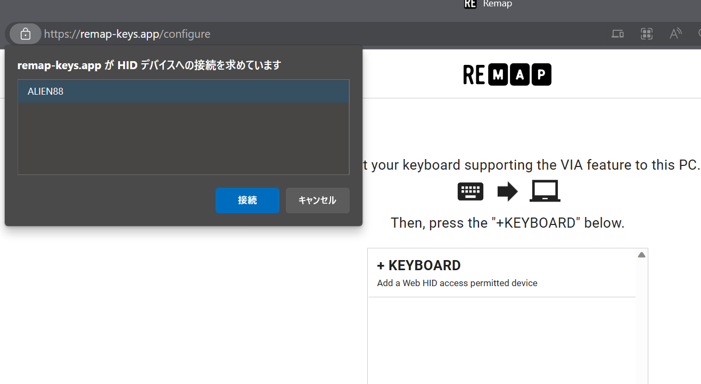
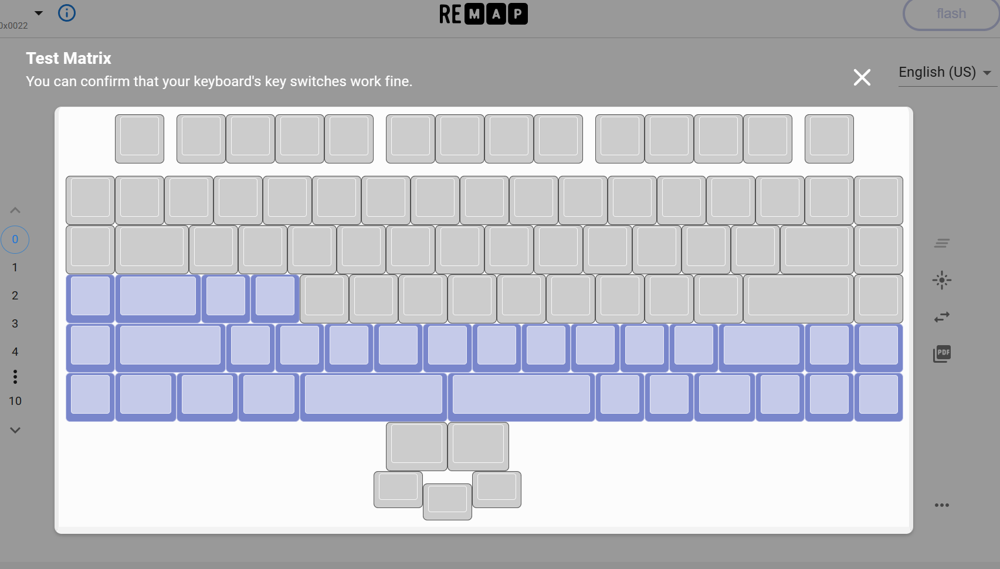

# ALIEN88 Installation Guide

- [ALIEN88 Installation Guide](#alien88-installation-guide)
  - [Required tools](#required-tools)
  - [1. Install switch sockets](#1-install-switch-sockets)
  - [2.Assemble the body](#2assemble-the-body)
  - [3. Assemble Stabilizers](#3-assemble-stabilizers)
  - [4. Put Switchs and a Caps](#4-put-switchs-and-a-caps)
  - [5. Test](#5-test)
    - [5-1 Confirmation of connection](#5-1-confirmation-of-connection)
    - [5-2 Test Matrix](#5-2-test-matrix)
  - [trouble-shooting](#trouble-shooting)

These build procedures are common to both TKL and NumPad with a few exceptions.

## Required tools
  

## 1. Install switch sockets

Solder a total of 91 switch sockets to the back of the PCB.
For NumPad, install 23 pieces.

  

  

## 2.Assemble the body

Joint the plate with screws and spacers.

  

## 3. Assemble Stabilizers

(TKL only)

  

## 4. Put Switchs and a Caps

  

- Example of a typical cap arrangement

  

## 5. Test

### 5-1 Confirmation of connection
Connect the keyboard to the PC with a USB cable.Then check the following items

- [ ] ホストPCに、ALIEN88という名前のキーボードとして認識されること
- [ ] キーボードのLEDライトが光ること

### 5-2 Test Matrix
 Webブラウザから次のURLを開いてスイッチの試験を行います。

  https://remap-keys.app/configure

- 画面の +KEYBOARD をクリックし、リストからALIEN88を選択し接続ボタンをクリックします。

  

  キーマップ編集画面が開いたら、右下の … メニューから TEST MATRIXをクリックします

  

- Test Matrixモードでは、キーボードのスイッチが正しく反応するかを確認することができます。

  すべてのキーと、レバースイッチの動作を確認してください。

  

  - [ ] すべてのスイッチとレバーの操作が正しく反応すること

反応しないキーがあった場合 は trouble-shooting を参照して下さい。

すべてのキーの反応が確認できれば、組み立ては完了です!

## trouble-shooting

- 反応しないキーがある
  
  多くの場合、原因は次の2点です。順に確認して対処して下さい。

1. キースイッチのピンが折れている

    スイッチをキーボードに乗せるときピンが折れているかもしれません。一度取り出して確認して下さい。
	もし折れていたらペンチなどでそっと伸ばしてから再び取り付けて下さい。

2. スイッチソケットのハンダ不良
 
    スイッチソケットのはんだ付けを忘れている もしくは うまくできていない、場合もキーが反応しません。
	ボトムプレートを外し、問題の箇所をよく確認して是正して下さい。

--------
[HOME](../README.MD)