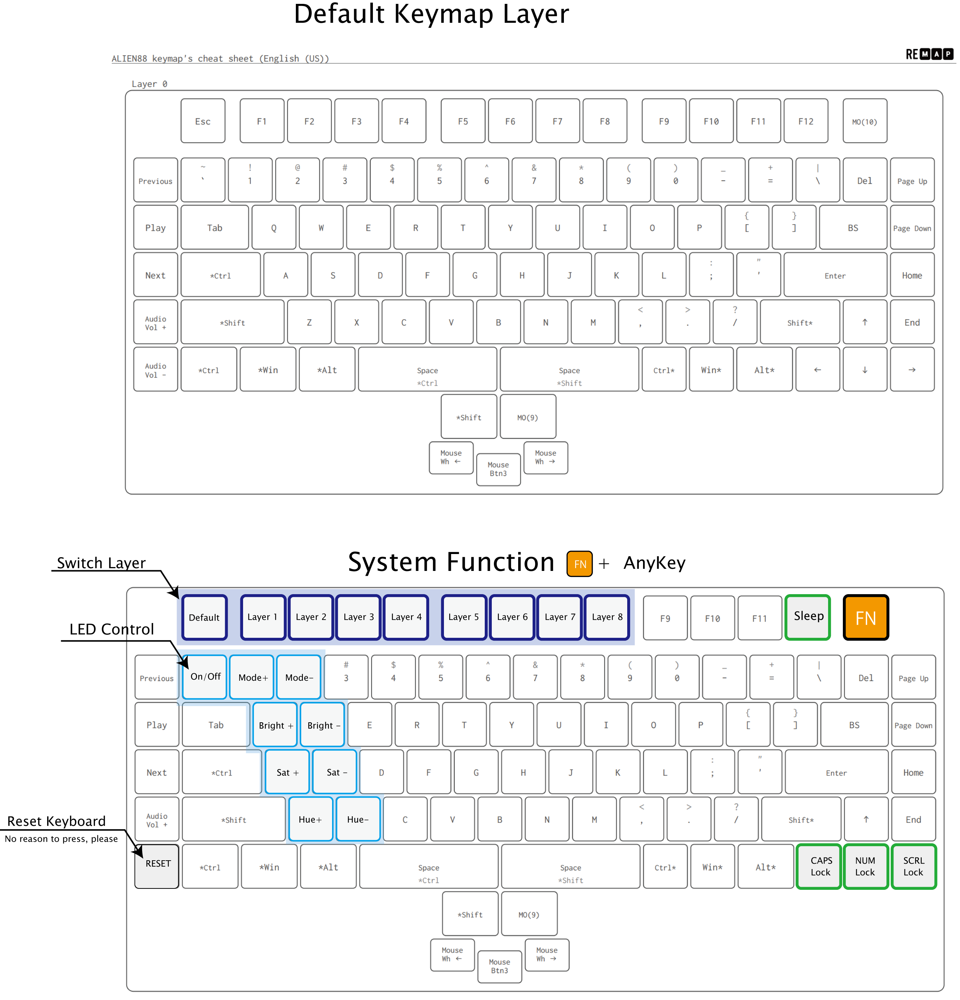
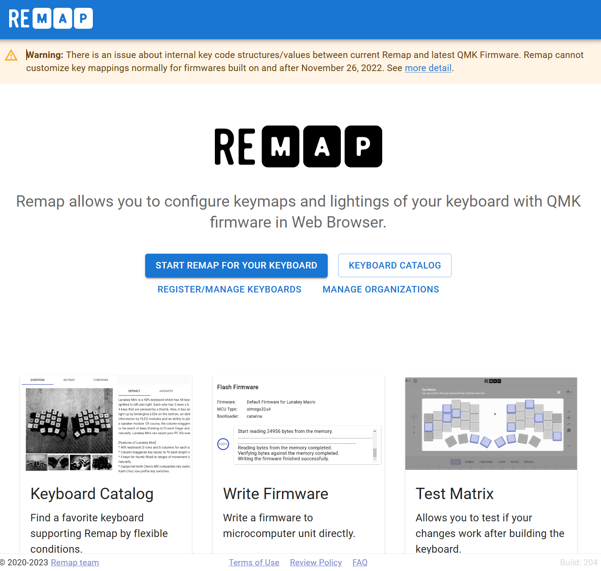

# ALIEN88 User's Guide
- [ALIEN88 User's Guide](#alien88-users-guide)
	- [1．ALIEN88でできること](#1alien88でできること)
	- [2. Default keymap](#2-default-keymap)
	- [3. キーマップの変更](#3-キーマップの変更)
	- [4．言語環境について](#4言語環境について)
	- [5. ファームウェアの更新](#5-ファームウェアの更新)
	- [6. ファームウェアの改造](#6-ファームウェアの改造)

## 1．ALIEN88でできること

- キーマップ
  
  レバースイッチを含む全てのキーは、ユーザの自由に再定義できます。
  後述するReMAPを用いることで視覚的に簡単にキーマップを変更できます。

- レイヤー

  デフォルトレイヤー を含めると最大9つのユーザレイヤーがあります。
  アプリケーションやゲームに応じたキーマップをレイヤーに分けてカスタマイズできます。
  定義したレイヤーはいつでも簡単な操作で呼び出すことができます。

- モッドタップ

  モッドタップ は、押したままの時にモディファイアのように機能し、タップされた時に通常のキーのように振舞います。別の言い方をすると、タップした時に SPACE を送信しますが、押したままの時に Control あるいは Shift キーとして機能するキーを持つことができます。

- マクロ

  マクロにより、1つのキーを押すだけで複数のキーストロークを送信することができます。ReMAP Toolでマクロを定義し、それを呼び出すキーを設定できます。マクロはなんでもすることができます: よく使うフレーズの入力、コピーペースト、反復的なゲームの動き、あるいはコードを書くことさえ手助けします
 
  もしゲームで利用する場合、そのゲームに関するレギュレーションに違反することがないように注意して下さい。

- レバースイッチ

  右、左、奥の3つの動作が可能です。通常のキーと同じように自由にキーマップを定義できるので
  便利な使い方ができるでしょう。

- マウスキー

  マウスキーは、キーボードを使ってマウスをエミュレートできる機能です。キーを押すことでポインタカーソルを
  移動させる、ボタンクリックする、ホイールを操作するといったことを定義することができます。

## 2. Default keymap

  

## 3. キーマップの変更

ALIEN88のデフォルトキーマップは開発チームが設定した仮の姿です。使用する前に自分の好みや用途に応じてどんどん変更してもらう
想定ですので、積極的にカスタマイズをおたのしみください

Use ReMAP tool:   https://remap-keys.app/

  

## 4．言語環境について

ALIEN88は、物理的な配置としては英語配列(US ANSI)をベースにし独自の配合を行っています。

デフォルトキーマップでの理論配列は英語配列基準ですが日本語
あるいは他の言語設定でも問題なく利用することができます。

- もう少し解説

	ALIEN88を接続したPCが、それを英語キーボードとして認識するか日本語キーボードとして認識するかは
	OS上でのユーザ設定に依存します。
	例えばShiftキー + 2 を押した場合にキーボードはPCに対して ”Shift と 2 が同時押されている”という
	情報しか送りません。OS側で日本語キーボードと認識している場合は " 、英語配列として認識している場合は @ を入力するようにおなっています。

	日本語キーボードに特有の 「変換」「無変換」といったキーはデフォルトキーマップでは
	定義されていませんが必要に応じて、好きなキーの位置に定義することができます。
	この「変換」等のキーについても OS側が英語キーボードとしてALIEN88を認識している
	状況ではキーボードがキーコードを送っても無視されてしまいます。

- キー定義と キーキャップの表記のギャップ

	市場に出回っているロープロファイルのキーキャップは英語配列に準じたものしか入手できない状況です。
	日本語キーボードとして使用する場合は、キーの刻印と入力される記号部分が一致しないことは
	諦めるしか無いのが残念なところです。

## 5. ファームウェアの更新

もしALIEN88のファームウェアを更新する場合は下記の手順で行ってください。

- 最新ファームウェアの入手
  
   https://hanachi-ap.github.io/ALIEN88/firmware/

- 手順1
 
    下記の方式1 もしくは 方式2 いずれかを実行します。

	- 方式1 

		ALIEN88とPCをUSBケーブルで接続している状態で、
		FNキー と 一番左下隅のキーを同時に押下します。
	
		→ 手順2 にすすむ

	- 方式2
  
		ALIEN88からUSBケーブルを外した状態で、
		キーボード背面の USB端子横の穴にピンなどでボタンを押し続けながら
		USBケーブルを接続します。

		→ 手順2にすすむ

- 手順2

	- キーボードとしての認識が外れて、ストレージデバイスとして再認識されます。

	- ストレージデバイスのフォルダを開き、新たに書き込むファームウェアをデバイスにコピーしてさい。

	- うまくファームウェアが更新されれば再びキーボードとして機能し始めます。

## 6. ファームウェアの改造

上記はALIEN88の標準ファームウェアでできることの一部です。もし更に様々な機能を拡張したい場合、
ユーザ自身でファームウェアをカスタマイズすることができます。ぜひチャレンジしてみて下さい。

  - [Firmware Source code](https://github.com/hanachi-ap/kbd_firmware/tree/main/qmk_firmware/keyboards/hanachi_ap/) (for qmk_firmware_0.18)

  - [QMK Firmware document](https://docs.qmk.fm/#/ja/)
  
--------
[HOME](../README.md)